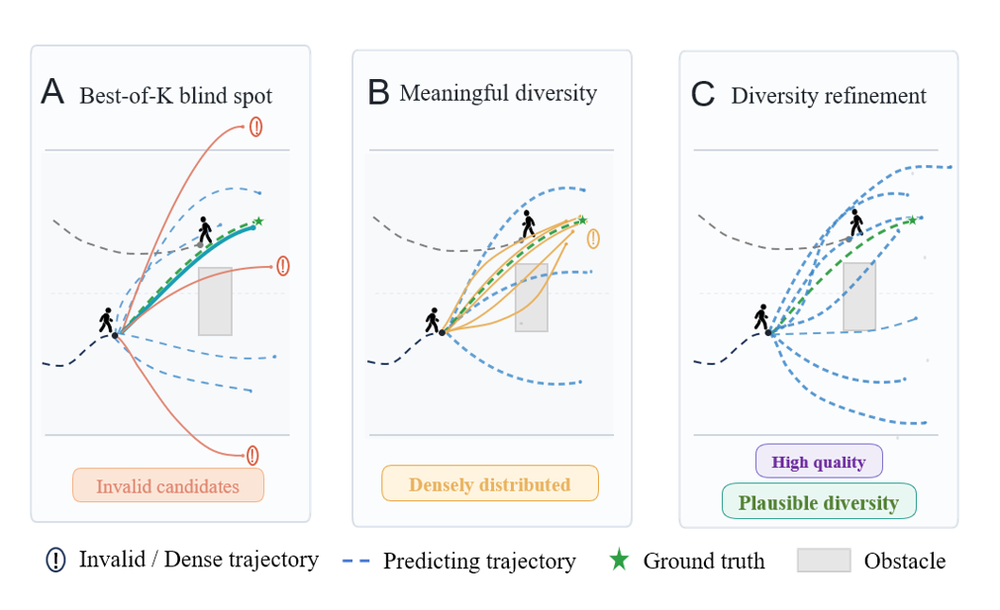

# Analogical Future Coverage (AFC)

Official implementation of **Analogical Future Coverage**, a protocol for
evaluating whether the non-oracle candidates in a multimodal trajectory
prediction set have empirical support. AFC retrieves training samples with
similar past-social states, clusters their actual futures into analogical
modes, and scores a prediction set on mode coverage, candidate support, and
continuous distance.

<p align="center">
  
</p>

## Overview

Best-of-K metrics (minADE, minFDE) check whether one candidate is close to
the ground truth. Geometric spread checks whether candidates are dispersed.
Neither tells you whether the other K−1 candidates are plausible. AFC fills
this gap by using the training data itself as empirical evidence: for each
query, it retrieves samples with similar observed past and social context,
and evaluates the prediction set against the futures that actually occurred
in those samples. Four complementary scores—weighted mode recall, precision,
unsupported ratio, and chamfer distance—capture dimensions invisible to
accuracy and spread.

This repository provides the AFC evaluation code, dataset adapters, experiment
scripts, and paper figures. It focuses on the evaluation protocol and analysis
tooling; it does not include full training pipelines, pretrained checkpoints,
or raw experiment outputs from the internal research workflow.

## Tested Environment

- Python 3.10
- PyTorch 2.x
- CUDA 12.x (optional, CPU-only evaluation is supported)
- Tested on Ubuntu 22.04

## Installation

```bash
conda create -n afc python=3.10
conda activate afc
pip install -r requirements.txt
```

Install PyTorch separately following the command that matches your CUDA
version from [pytorch.org](https://pytorch.org).

## Data Preparation

### ETH-UCY

Place the raw ETH-UCY text files under:

```text
trustmoe_traj/data/ETH/
  eth/
  hotel/
  univ/
  zara1/
  zara2/
```

Then build the local cache:

```bash
python -m trustmoe_traj.scripts.prepare_eth_cache --subset all --split all
```

### SDD

SDD evaluation requires MoFlow-format pickle files:

```text
MoFlow/data/sdd/original/sdd_train.pkl
MoFlow/data/sdd/original/sdd_test.pkl
```

A helper script creates symlinks automatically when the files exist at the
expected location:

```bash
bash trustmoe_traj/scripts/run_sdd_afc_p0_check.sh
```

### External Model Predictions

Each external baseline has its own prediction export script under
`trustmoe_traj/scripts/`. For example:

```bash
python -m trustmoe_traj.scripts.export_social_stgcnn_predictions
python -m trustmoe_traj.scripts.export_mid_predictions
python -m trustmoe_traj.scripts.export_tutr_predictions
```

Prediction files are written to the analysis output root configured by
`OUTPUT_ROOT` and `LOG_ROOT`.

## Quick Start

### 1. Prepare data

```bash
python -m trustmoe_traj.scripts.prepare_eth_cache --subset all --split all
```

### 2. Run AFC evaluation (ETH-UCY)

```bash
export MAIN=/path/to/TrustMoE-Traj-v38
export PY=python
bash trustmoe_traj/scripts/run_headroom_analysis.sh
```

Set `MAIN` to the repository root and `PY` to your Python interpreter before
running. The script evaluates AFC metrics on pre-exported MoFlow prediction
sets and writes results to the configured output directory.

### 3. Run AFC evaluation (SDD)

```bash
bash trustmoe_traj/scripts/run_sdd_afc_exp1.sh
```

Requires MoFlow SDD pickle files (see Data Preparation above).

## Reproducing the Paper

| Experiment / Figure | Main Script | What It Produces |
|---|---|---|
| Exp.1 discriminability | `diagnose_headroom_analysis.py` | `tab:diagnostic` |
| Exp.2 complementarity | `analyze_afc_exp2_complementarity.py` | `fig:scatter`, `tab:corr` |
| Exp.3 sampling headroom | `analyze_afc_exp3_sampling_headroom.py` | `fig:headroom` |
| Exp.4 Top-M / ε stability | `analyze_afc_exp4_topm_eps_stability.py` | heatmaps + claim stability table |
| Exp.5 retrieval visualization | `export_afc_exp5_retrieval_cases.py` | `fig:retrieval` |
| Exp.6 feature ablation | configurable via `--afc-feature-variant` in `diagnose_headroom_analysis.py` | `tab:feature` |
| Exp.7 leakage / robustness | configurable via `--afc-filter-same-source`, `--afc-temporal-gap-frames`, `--afc-randomize-bank-seed` | `tab:leakage` |
| Runtime benchmark | `benchmark_afc_runtime.py` | runtime table |
| External model evaluation | `export_<model>_predictions.py` + `diagnose_headroom_analysis.py` | `tab:external` |

Each analysis script writes CSV tables and figures to a configurable output
directory. Run identifiers follow the pattern `YYYYMMDD_<experiment>_<seed>`.

## Repository Structure

```text
trustmoe_traj/
  data/             ETH-UCY and SDD adapters, schema, processed cache
  evaluation/       Metric and evaluation utilities
  models/           MoFlow wrapper and diagnostic branch models
  scripts/          AFC evaluation, analysis, export, plotting, run wrappers
figures/            Paper figures
docs/               Supplementary results tables
```

## Supplementary Results

Detailed per-subset AFC results for the external baselines are in
[`docs/supplementary_results.md`](docs/supplementary_results.md).

This public release includes the evaluation code, experiment scripts, and
paper figures. Intermediate experiment artifacts and raw outputs from the
internal research workflow are not included; the scripts above can regenerate
the reported figures and tables from the corresponding experiment runs.

## Citation

```bibtex
@inproceedings{afc2026,
  title     = {Beyond Best-of-{K}: Analogical Future Coverage for
               Evaluating Multimodal Trajectory Prediction},
  author    = {Anonymous},
  booktitle = {Under review},
  year      = {2026}
}
```

Citation will be updated with the final venue information upon publication.

## License

This project is licensed under the MIT License. See [LICENSE](LICENSE) for
details. External baseline wrappers in `trustmoe_traj/scripts/export_*.py`
may depend on upstream projects with their own licenses.
